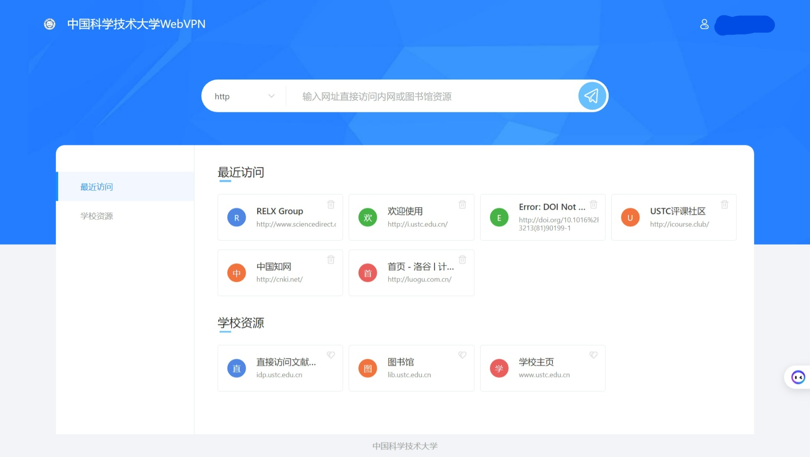

部分编者觉得比较实用的网站、软件、语言等工具。其中部分软件可在“正版软件”中下载、安装正版，网址为： [https://zbh.ustc.edu.cn/zbh.php](https://zbh.ustc.edu.cn/zbh.php)。

## Web VPN

Web VPN（[https://wvpn.ustc.edu.cn](https://wvpn.ustc.edu.cn/)）可以通过学校统一身份认证登录。登录后进入需要校园网才能进入的网站， 有很强的实用性。

在上面的搜索栏输入想要访问的网址，就相当于在校园网中访问了同样的网址。例如上面提到的正版软件网站（[https://zbh.ustc.edu.cn/zbh.php](https://zbh.ustc.edu.cn/zbh.php)）无法访问，但利用Web VPN就可以实现在家中下载需要的软件，非常方便。

## ustc.life

[https://ustc.life](https://ustc.life) ，一个导航网站，综合了USTCer日常生活和学业常用的网站，有很强的实用性。可以设为浏览器主页，便于随时使用。

## 网上办事服务平台

[https://i.ustc.edu.cn](https://i.ustc.edu.cn) ，可以看作学校官方提供的导航网站，包括了在USTC能够使用的几乎全部网上办事网站。

## 评课社区

评课社区（[https://icourse.club](https://icourse.club)）是中科大特有的公开评课网站，绝大部分一二年级课程， 都基本有相对客观且足量的评课，可以作为选课很好的参考。

但是一定要注意，评课社区毕竟是**公开且基本不会审核**的，因此总会有极端课程，如评分巨高但是实际课程体验不好的、评分一般但是实际课程体验不错的。千人千体验，这是很正常的，最好的办法就是多方面了解。

同时，我们也希望，各位看见本指南的同学，能够积极使用评课社区、积极宣传评课社区，并且在给老师评分的时候，尽量从多角度多方面给老师一个较为完善较为合理的评分，这样评课社区才会愈变愈好，我们才能从侧面逼迫科大部分老师提升相关课程教学质量。

## USTC飞跃网站

USTC 飞跃网站[https://www.ustcflyer.com/welcome](https://www.ustcflyer.com/welcome)）的前身（或者说来源）为 各个学院编写的USTC 飞跃手册，核心是传递出国申请的各种经验，可以了解申请过程的全貌、获取所需信息、查看各种案例等。内附有往届 USTC 飞跃群 QQ 群号。

## 南七茶馆

南七茶馆（[https://ustcforum.com](https://ustcforum.com)）是科大新的综合型 BBS 网站，有各种关于学习、生活的帖子，遇到各种困难也可以发帖询问，整体热度较高。其中精华帖有“科大学习指南”，本文档也有所参考。

## 蜗壳学社

蜗壳学社（[https://ot.ustc.edu.cn](https://ot.ustc.edu.cn)）由教务处发起，是一个面向中国科大学子的在线学业辅导与交流平台，旨在为科大学子提供具有个性化定制的学业辅导服务。在这里可以找到很多真题及其解答，还有很多资料，考试周必备。

## LaTeX

$$
\LaTeX
$$

本指南的pdf版全部使用LaTeX编写。LaTeX是一种排版工具（语言），常见于各类学术论文的写作。几乎所有影响因子还不错的期刊，都会要求使用LaTeX进行学术论文的编写和排版。

LaTeX有以下好处：数学物理化学等公式可以较为方便的给出、排版更加学术风格、适合小组合作共同编写、排版格式可以通过简单的操作进行全局调整。适合编写：实验报告、论文、项目报告等。

LaTeX很好入门，也有很多相关的模版可供选择。推荐：《一份（不太）简短的LATEX2ϵ 介绍》 （点击下载）。在本地编配并使用 VsCode 编辑，参考[https://zhuanlan.zhihu.com/p/38178015](https://zhuanlan.zhihu.com/p/38178015) 进行编配（Mac 端需要下载 Mactex，其他类似），也推荐在 [https://www.overleaf.com](https://www.overleaf.com/) 或USTC校内网站 [https://latex.ustc.edu.cn](https://latex.ustc.edu.cn/) 上在线编辑。

## 常用计算机语言与软件

Matlab 和 Mathematica 是两款数学计算模拟软件，前者更偏向于数值计算与模拟、后者更偏向于解析解的计算，在理工类科研中常常被用到。关于两者的安装和使用入门可以自行在 B 站搜索视频学习。 （**Matlab和Mathematica在学校正版化网站中均有提供，但Mathematica仅提供较老的12.0版本，且是学生版部分功能受限；Matlab因为美国新一轮制裁，现在已经停止支持**）

Python 和 C++、Java 一样，是一种计算机语言，由于其有各类出色的可调用包和函数以及简单易学的语法，很多人都用 Python 做一些数据处理、图像绘制等。建议 C 语言学习完后可以继续学习 Python，可自行搜索教程学习。

Origin 是一款数据分析处理画图软件，主要用于实验数据的整理与图像的输出，可以画出 很精美的图象。可自行搜索教程学习。（**学校正版化网站有提供，请注意MacOS并不支持Origin软件，可以考虑使用Python自行编写代码替代，或者使用虚拟机运行**）

## Z-Library

Z-Library 是全球最大的数字图书馆，很多课本、资源可以在该网站上找到。由于涉及版权 问题，Zlib 经常更换域名，可以通过[https://discuss.sci-hub.org.cn/d/2548/2](https://discuss.sci-hub.org.cn/d/2548/2)上找到对应可用域名。对于找不到的图书和课本，可以寻找各类资料群、学长求助。

## 学在科大、我的科大

两者均是由学生制作的功能性软件，包含各类便利学生的功能。强烈建议至少下载其中之一。

我的科大：[https://wdkd.feixu.site/](https://wdkd.feixu.site/)

学在科大：[http://home.ustc.edu.cn/\~linzihan322/download.htm](http://home.ustc.edu.cn/\~linzihan322/download.htm)
